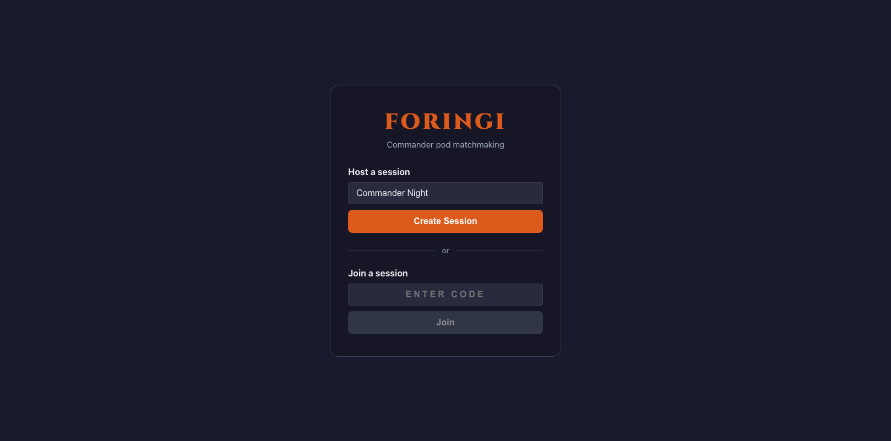
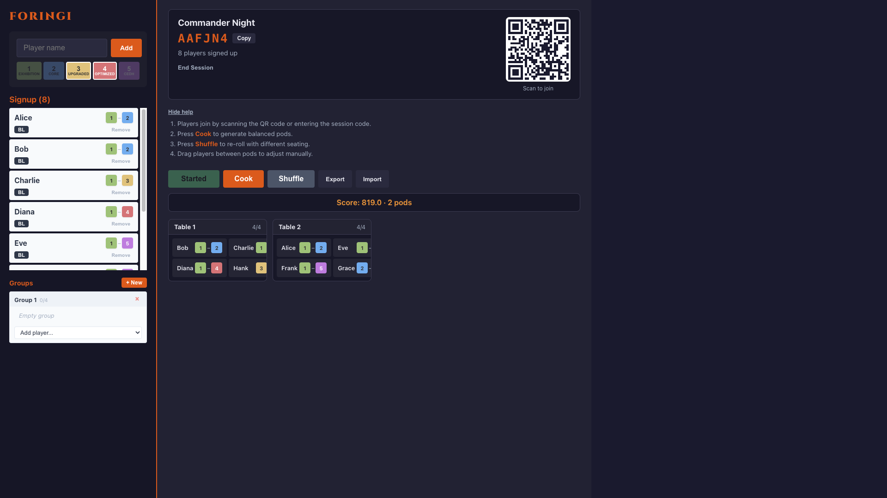
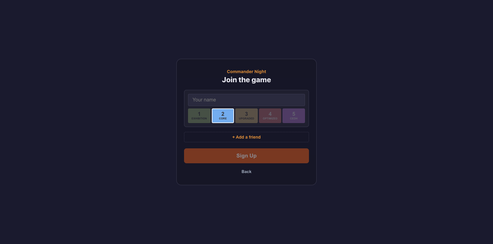

# Foringi User Guide

Foringi helps you organise Magic: The Gathering Commander game nights. A host creates a session, players join in, and the app sorts everyone into balanced 4-player pods.

## For Hosts

### Creating a Session

1. Open the app and tap **Create Session**.
2. Give it a name (defaults to "Commander Night").
3. You'll be taken to the host dashboard with a unique 6-character session code.

Your host URL contains a private token in the hash fragment (e.g. `/host/ABC123#token`). Keep this link -- it's your key to managing the session.

### Sharing the Session

The dashboard displays a **QR code** and the **session code**. Players can either:

- Scan the QR code with their phone.
- Go to the app and enter the 6-character code manually.

### Adding Players Manually

Use the player form on the sidebar to add players yourself. Enter a name and select one or more power level brackets (see [Power Levels](#power-levels) below).

### Managing Groups

Groups let players sit together. Tap **Add Group** in the group panel, give it a name, and select 2-4 members.

- **Groups of 4** become a locked pod -- they're placed together and the algorithm won't rearrange them.
- **Groups of 2-3** are pre-seated at the same table, but the remaining seats are filled by the algorithm.

### Setting Blacklists

Blacklists prevent specific players from being seated together. Open the relationship editor, select two players, and add a blacklist entry.

Blacklists are mutual: if Player A blacklists Player B, they won't be placed at the same table regardless of which one was added first.

### Running the Matchmaker

The action bar has three main buttons:

- **Start** -- Runs the A\* search for the first time in a session to produce an initial seating arrangement. Disabled once a solution exists.
- **Cook** -- Runs the A\* search algorithm to find an optimal arrangement. Takes up to 20 seconds and returns the best solutions found. Use this when you want the most balanced pods.
- **Shuffle** -- Runs a quick random assignment. Use this when you want a fast alternative or just want to mix things up.

A progress bar shows how the search is going (nodes explored and solutions found). You can cancel at any time.

### Reading the Results

After a search completes, the pod grid shows:

- Each pod with its seated players.
- Player names and their power level badges.
- The solution's heuristic score (lower is better).

### Manual Adjustments

Drag and drop players between pods to make manual changes after the algorithm runs. This is useful for last-minute swaps or accommodating preferences the algorithm doesn't know about.

### Exporting and Importing Player Data

- **Export** -- Downloads the current player list as a JSON file. Useful for saving your regulars between sessions.
- **Import** -- Load a previously exported JSON file to quickly populate the player list.

## For Players

### Joining a Session

1. Scan the QR code your host is showing, or open the app and enter the session code.
2. Enter your name.
3. Select your power level bracket(s) -- tap a single bracket, or tap two brackets to set a range.
4. Tap **Join**.

### Joining with Friends

You can join with up to 3 friends in a single form (4 players total). Each person enters their name and brackets. The host will see you as a group.

### Power Levels

Foringi uses 5 power brackets, loosely aligned with community convention:

| Level | Bracket | Typical Decks |
|---|---|---|
| 1 | Exhibition | Precons, theme decks, intentionally powered-down builds |
| 2 | Core | Upgraded precons, focused but not optimised strategies |
| 3 | Upgraded | Tuned decks with good mana bases and synergies |
| 4 | Optimized | High-power decks, strong combos, efficient interaction |
| 5 | cEDH | Competitive EDH -- fast combos, stax, optimised to win |

You can select a single bracket or a range. For example, if you're happy playing at Core through Optimized, select brackets 2 through 4. The algorithm will try to seat you with players whose range overlaps yours.

### Viewing Your Pod

Once the host runs the matchmaker, your screen updates to show:

- Which pod (table) you're assigned to.
- Your tablemates and their power levels.

The page polls for updates every few seconds, so you'll see your assignment shortly after the host locks it in.

### Leaving a Session

Tap **Leave** on the joined screen to remove yourself from the session.

## How Matchmaking Works

The algorithm considers several factors when assigning players to pods:

- **Power level balance** -- Players at the same table should have overlapping power brackets. A table with an Exhibition player and a cEDH player is heavily penalised.
- **Blacklists** -- Players on each other's blacklist will not be seated together. This carries the highest penalty.
- **Table size** -- Pods are best with 4 players. Empty seats and unseated players are both penalised.
- **Play history** -- If you've played together recently, the algorithm lightly prefers seating you with someone new.
- **Groups** -- Pre-formed groups are respected. Full groups of 4 get their own table automatically.

The **Cook** button explores thousands of possible arrangements using an A\* search and picks the best ones. The **Shuffle** button makes a quick random assignment -- useful for variety or when speed matters more than perfection.

The score shown on each solution is a sum of penalties. A score of 0 would mean every player is perfectly matched -- in practice, lower is better and the algorithm returns the best arrangements it finds within 20 seconds.
